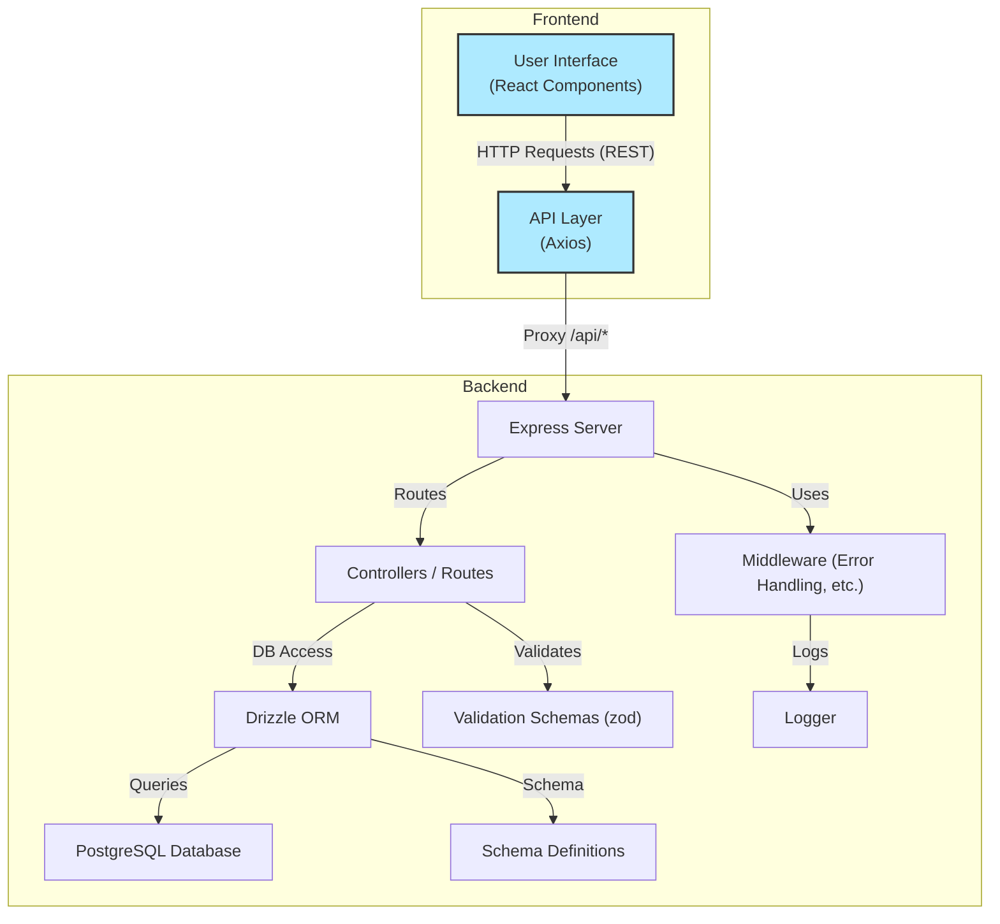

# Todo List Monolith

Monolithic Todo List application. It features a PostgreSQL database, an Express backend using Drizzle ORM, and a React + Vite frontend.

## Project Structure

```
todo-list-monolith/
  backend/    # Express API, Drizzle ORM, PostgreSQL models, migrations
  frontend/   # React app (Vite, Tailwind CSS, Shadcn UI)
  package.json  # Monorepo scripts
```

## Diagram



### Backend

- **Tech:** Node.js, Express, TypeScript, Drizzle ORM, PostgreSQL
- **Location:** `backend/`
- **Main entry:** `backend/index.ts`
- **API endpoints:** User registration, login, CRUD for tasks
- **Migrations:** Managed with Drizzle Kit

### Frontend

- **Tech:** React, TypeScript, Vite, Tailwind CSS
- **Location:** `frontend/`
- **Main entry:** `frontend/src/main.tsx`
- **Features:** User login/registration, create/update/delete tasks

## Getting Started

### Prerequisites

- Node.js (v18+ recommended)
- PostgreSQL database

### 1. Clone the repository

```bash
git clone https://github.com/daniiprietoo/todo-list-monolith-architecture
cd todo-list-monolith-architecture
```

### 2. Install dependencies

```bash
npm install
```

### 3. Configure environment variables

- Copy `.env.example` to `.env` in `backend/` and set your `DATABASE_URL` and `FRONTEND_URL`.

### 4. Run database migrations

```bash
cd backend
npx drizzle-kit push:pg
```

### 5. Start the development servers

From the root directory:

```bash
npm run dev
```

- This will start both the backend (on port 4000) and the frontend (on port 5173 by default).

### 6. Open the app

Visit [http://localhost:5173](http://localhost:5173) in your browser.

## Scripts

- `npm run dev` — Start both backend and frontend in development mode
- `npm run dev:backend` — Start backend only
- `npm run dev:frontend` — Start frontend only
